***


# 📊 Statistics for Data Science Practice Workbook
## Part 1 — Statistical Foundations (Videos 1–5)

> **The Data Science Thinking Pattern:** 
> `Understand` → `Calculate` → `Interpret` → `Apply` → `Code`

---

## 🎥 Video 1: Introduction to Statistics

### 📘 Notes
Statistics is the process of transforming raw data into actionable insights. In Data Science, raw data is not useful alone.

**The Statistical Process:**

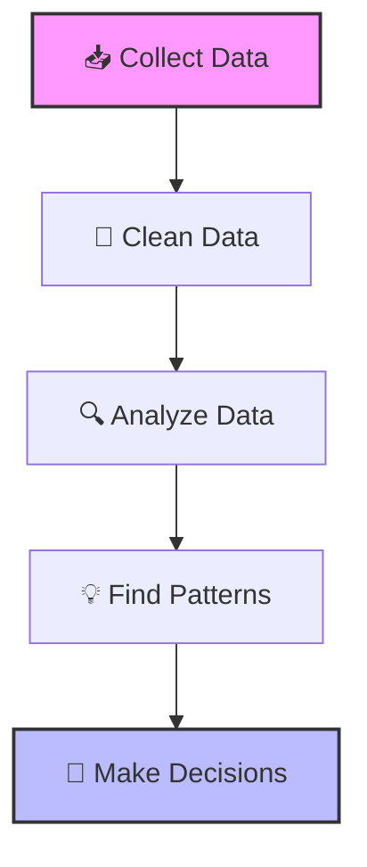

**Example:**
Netflix has raw data (User A watched 50 movies, rated 30, skipped 10). Statistics transforms this into: *"User likes science fiction movies."*

### 🧠 Mental Model
Data is just noise until we apply statistical thinking to find the signal. 

### ✏️ Exercises

**Exercise 1 (Beginner)**
A company collects customer data:

| Customer | Age | Purchases |
| :--- | :--- | :--- |
| Ahmed | 25 | 5 |
| Sara | 30 | 8 |
| Ali | 22 | 3 |

1. What is the data?
2. What information can statistics extract?
3. What decision can the company make?

**Exercise 2 (Data Science Thinking)**
A hospital stores: Patient ID, Age, Blood Pressure, Disease Status, Treatment, Recovery Time.
1. Identify the raw data.
2. Identify a possible analysis.
3. Identify a possible decision.

**Exercise 3 (AI Application)**
You build a recommendation system. Available data: Movie watched, Watch duration, Rating, Search history. What statistical patterns can you discover?

<details>
<summary><b>✅ Click to see Solutions</b></summary>
<br>

**Data Scientist's Thinking Pipeline:**
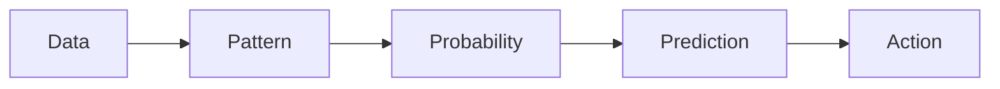
- **Ex 1:** Data = the table. Info = Average age is ~25, average purchases is ~5. Decision = Target marketing campaigns to the 20-30 age demographic.
- **Ex 2:** Raw data = the patient records. Analysis = Correlation between Age/Blood Pressure and Recovery Time. Decision = Allocate more ICU resources to patients over 50 with high blood pressure.
- **Ex 3:** Patterns = Users who watch Sci-Fi for >40 mins also rate Action movies highly; search history correlates with weekend watch duration.
</details>

---

## 🎥 Video 2: Population vs Sample

### 📘 Notes
- **Population:** Everything we want to study (The whole).
- **Sample:** A small part representing the population (The subset).

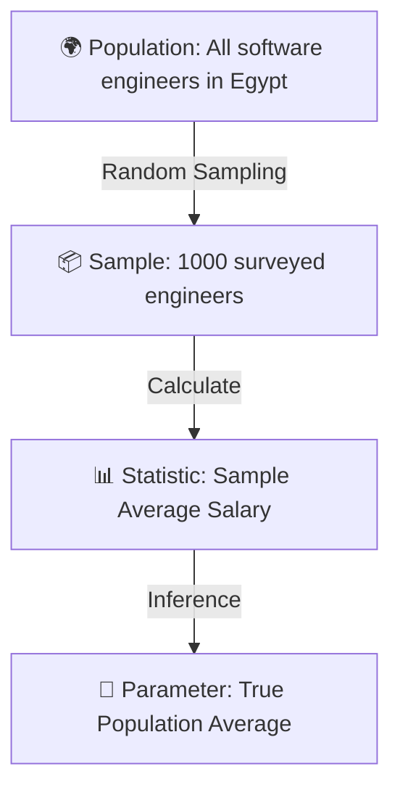

### 🧠 Mental Model
We can rarely measure everything. We measure a representative piece and infer the whole. In Machine Learning, this is the exact logic behind **Train vs. Test splits**.

### ✏️ Exercises

**Exercise 1**
A university has 20,000 students. A researcher selects 500 students.
1. Population?
2. Sample?
3. Parameter?
4. Statistic?

**Exercise 2**
A company wants to know customer satisfaction. Database has 2 million customers. Survey sent to 10,000 customers.
1. Population?
2. Sample?

**Exercise 3 (Machine Learning)**
You train a model. Dataset: 100,000 images. The model is tested on 10,000 *new* images.
1. Which represents the Population?
2. Which represents the Sample?
3. Which is the Training data?
4. Which is the Unseen data?

<details>
<summary><b>✅ Click to see Solutions</b></summary>
<br>

- **Ex 1:** Pop = 20,000 students. Sample = 500 students. Parameter = True average GPA/age of all 20k. Statistic = Average GPA/age of the 500.
- **Ex 2:** Pop = 2 million customers. Sample = 10,000 customers.
- **Ex 3:** Pop = All possible images in the real world. Sample = The 100,000 collected images. Training data = Subset of the 100k used to train. Unseen data = The 10,000 new test images.
</details>

---

## 🎥 Video 3: Types of Variables

### 📘 Notes
Variables dictate the math we can do. We can't average "Country", but we can average "Age".

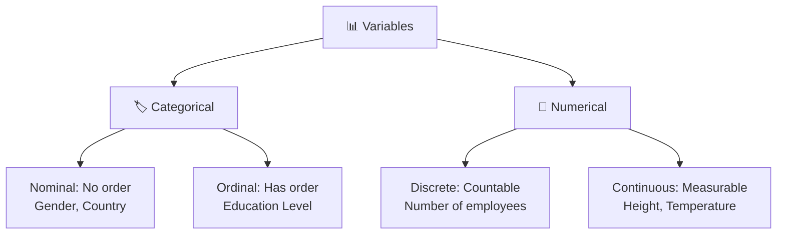

### 🧠 Mental Model
Choosing the right machine learning algorithm depends entirely on variable types. You cannot use Linear Regression on a Nominal variable without encoding it first.

### ✏️ Exercises

**Exercise 1**
Classify the following variables:

| Variable | Type (Nominal/Ordinal/Discrete/Continuous) |
| :--- | :--- |
| Height | ? |
| Country | ? |
| Number of employees | ? |
| Education level | ? |
| Temperature | ? |

**Exercise 2**
A machine learning dataset contains: Age, Income, Occupation, Purchased Product, Number of Visits. Classify every variable.

**Exercise 3**
A hospital dataset: Blood Type, Patient Age, Disease Severity (Low/Medium/High), Recovery Days. Identify the Nominal, Ordinal, Discrete, and Continuous variables.

<details>
<summary><b>✅ Click to see Solutions</b></summary>
<br>

- **Ex 1:** Height (Continuous), Country (Nominal), Num employees (Discrete), Education level (Ordinal), Temperature (Continuous).
- **Ex 2:** Age (Continuous/Discrete depending on precision), Income (Continuous), Occupation (Nominal), Purchased Product (Nominal/Categorical), Number of Visits (Discrete).
- **Ex 3:** Blood Type (Nominal), Patient Age (Continuous), Disease Severity (Ordinal), Recovery Days (Discrete).
</details>

---

## 🎥 Video 4: Descriptive Statistics

### 📘 Notes
Descriptive statistics answers: *"What happened in the data?"*

- **Mean:** Average ($\frac{\sum x}{n}$)
- **Median:** Middle value (robust to outliers)
- **Variance:** How spread out data is.
- **Standard Deviation:** Average distance from the mean.

### 🧠 Mental Model
Mean tells us the center; Variance tells us the risk/spread. In finance, high variance = high risk. In Machine Learning, high variance in model performance = overfitting.

### ✏️ Exercises

**Exercise 1**
Calculate for dataset: `10, 20, 30, 40, 50`
1. Mean
2. Median
3. Range

**Exercise 2**
- **Class A:** 70, 70, 70, 70, 70
- **Class B:** 50, 60, 70, 80, 90

1. Do they have the same mean?
2. Which has larger variance?
3. Which class is more consistent?

**Exercise 3 (Data Science)**
A model's accuracy over 5 cross-validation folds: `90%, 91%, 89%, 50%, 92%`. What should you investigate?

<details>
<summary><b>✅ Click to see Solutions</b></summary>
<br>

- **Ex 1:** Mean = 30, Median = 30, Range = 40.
- **Ex 2:** Yes, same mean (70). Class B has larger variance. Class A is more consistent (variance = 0).
- **Ex 3:** Investigate the 50% fold! It's a massive outlier. Check if that specific fold had imbalanced data, data leakage, or a bug in the split.
</details>

---

## 🎥 Video 5: Normal Distribution

### 📘 Notes
The Normal Distribution is a bell-shaped curve where Mean = Median = Mode.

**The 68-95-99.7 Rule:**
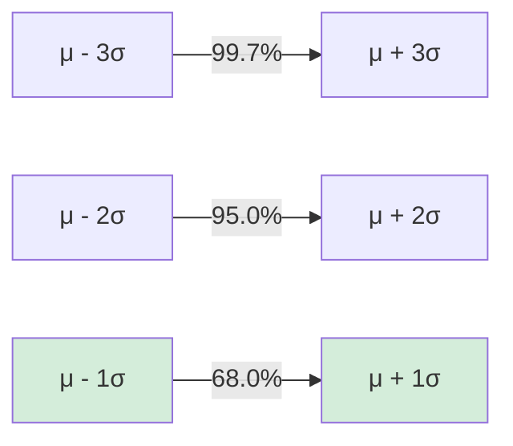

### 🧠 Mental Model
Many natural phenomena follow the bell curve. If your data isn't normal, you might need to apply transformations (like Log) or use non-parametric statistical tests.

### ✏️ Exercises

**Exercise 1**
Exam scores: Mean = 80, SD = 10. Find the range containing approximately:
1. 68% of students
2. 95% of students
3. 99.7% of students

**Exercise 2**
IQ scores: Mean = 100, SD = 15. A person has an IQ of 130. How many standard deviations above the mean are they?

**Exercise 3 (Machine Learning)**
A feature "Age" has Mean = 40, SD = 10. Normalize Age = 60 using the Z-score formula: 
$$ z = \frac{x - \mu}{\sigma} $$

### 💻 Python Practice
Create a dataset and calculate descriptive stats using NumPy:

```python
import numpy as np

scores = [60, 70, 80, 90, 100]

print("Mean:", np.mean(scores))
print("Median:", np.median(scores))
print("Variance:", np.var(scores))
print("Standard Deviation:", np.std(scores))
```

### 🚀 Mini Project 1: Student Performance Analysis
**Dataset columns:** `Student_ID`, `Age`, `Study_Hours`, `Attendance`, `Exam_Score`

**Tasks:**
1. Identify variable types for each column.
2. Calculate the mean and standard deviation of `Exam_Score`.
3. Plot a histogram of `Exam_Score`.
4. Describe the distribution (Is it normal? Skewed?).

**Expected Data Science Output:**
> *"The average score is X. Most students are concentrated around Y. The distribution appears normal/skewed, indicating..."*

<details>
<summary><b>✅ Click to see Solutions</b></summary>
<br>

- **Ex 1:** 68% → 70 to 90. 95% → 60 to 100. 99.7% → 50 to 110.
- **Ex 2:** $z = \frac{130 - 100}{15} = 2$. They are 2 standard deviations above the mean.
- **Ex 3:** $z = \frac{60 - 40}{10} = 2$. The normalized Z-score is 2.
</details>

---


***


# 📊 Statistics for Data Science Practice Workbook
## Part 2 — Sampling & Confidence (Videos 6–9)

> **The Data Science Thinking Pattern:** 
> `Understand` → `Calculate` → `Interpret` → `Apply` → `Code`

---

## 🎥 Video 6: Sampling Methods

### 📘 Notes
How we select data dictates the quality of our conclusions. Bad sampling = biased models.

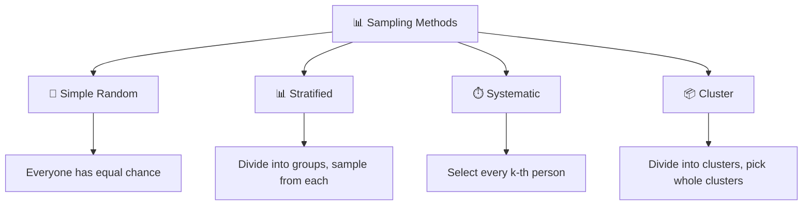

### 🧠 Mental Model
In Machine Learning, if you have an imbalanced dataset (e.g., 99% Class A, 1% Class B), **Simple Random Sampling** might result in a test set with zero Class B examples. You must use **Stratified Sampling** to ensure both train and test sets maintain the exact same class proportions.

### ✏️ Exercises

**Exercise 1 (Beginner)**
Identify the sampling method used in each scenario:
1. A teacher puts all student names in a hat and draws 10 names.
2. A researcher divides a city into North, South, East, and West. They randomly pick 2 zones and survey *everyone* in those zones.
3. A quality control manager checks every 50th laptop that comes off the assembly line.

**Exercise 2 (Data Science Thinking)**
You are building a fraud detection model. The dataset has 1,000,000 normal transactions and 10,000 fraud transactions. You need to split the data into 80% train and 20% test. 
Which sampling method should you use for the split, and why?

**Exercise 3 (Business Scenario)**
A retail chain has 500 stores nationwide. They want to survey customer satisfaction but don't have the budget to visit all stores. They randomly select 30 stores and interview every customer who enters those 30 stores for a week. What method is this?

<details>
<summary><b>✅ Click to see Solutions</b></summary>
<br>

- **Ex 1:** 1) Simple Random. 2) Cluster (selected whole zones). 3) Systematic.
- **Ex 2:** Stratified Sampling. If you use simple random, the 20% test set might randomly end up with very few or zero fraud cases, making your evaluation metric (like Recall) unreliable. Stratified ensures exactly 2,000 fraud cases end up in the test set.
- **Ex 3:** Cluster Sampling. They didn't sample individual stores; they sampled whole "clusters" (stores) and surveyed everyone inside them.
</details>

---

## 🎥 Video 7: Central Limit Theorem (CLT)

### 📘 Notes
The most important theorem in statistics. It states:
*If you take many random samples of size **n** from ANY population, the distribution of the **sample means** will be approximately Normal, as long as **n** is large enough (usually n ≥ 30).*

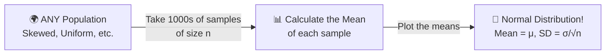

### 🧠 Mental Model
Real-world data (like income or house prices) is rarely normally distributed; it's usually heavily skewed. The CLT is the "magic trick" that allows us to use Normal Distribution math (like Z-tests) on non-normal data, because the *averages* of that data will be normal.

### ✏️ Exercises

**Exercise 1 (Conceptual)**
The population distribution of "Time spent on social media" is highly skewed to the right (most people spend a little, a few spend a massive amount). 
You take 1,000 random samples of size 50, and calculate the mean of each sample. What is the shape of the distribution of these 1,000 sample means?

**Exercise 2**
True or False: The Central Limit Theorem guarantees that the *individual data points* in your sample will form a normal distribution.

**Exercise 3 (Machine Learning)**
In ensemble learning (like Random Forest), we use "Bagging" (Bootstrap Aggregating), which involves taking many random samples of the training data with replacement and averaging their predictions. How does the CLT justify why Bagging works so well?

<details>
<summary><b>✅ Click to see Solutions</b></summary>
<br>

- **Ex 1:** Approximately Normal (Bell-shaped). Even though the original population is skewed, the CLT guarantees the distribution of the *sample means* will be normal because n=50 (which is ≥ 30).
- **Ex 2:** False. The CLT applies to the distribution of the *sample means*, not the individual raw data points.
- **Ex 3:** Because each individual tree is trained on a random sample, its prediction is like a "sample mean". By the CLT, averaging the predictions of hundreds of trees reduces the variance and results in a highly stable, normally distributed final prediction.
</details>

---

## 🎥 Video 8: Standard Error (SE)

### 📘 Notes
People confuse Standard Deviation (SD) and Standard Error (SE). 
- **SD:** Measures the spread of *individual data points*.
- **SE:** Measures the accuracy of the *sample mean* (how much the sample mean varies from the true population mean).

**Formula:**
$$ SE = \frac{SD}{\sqrt{n}} $$

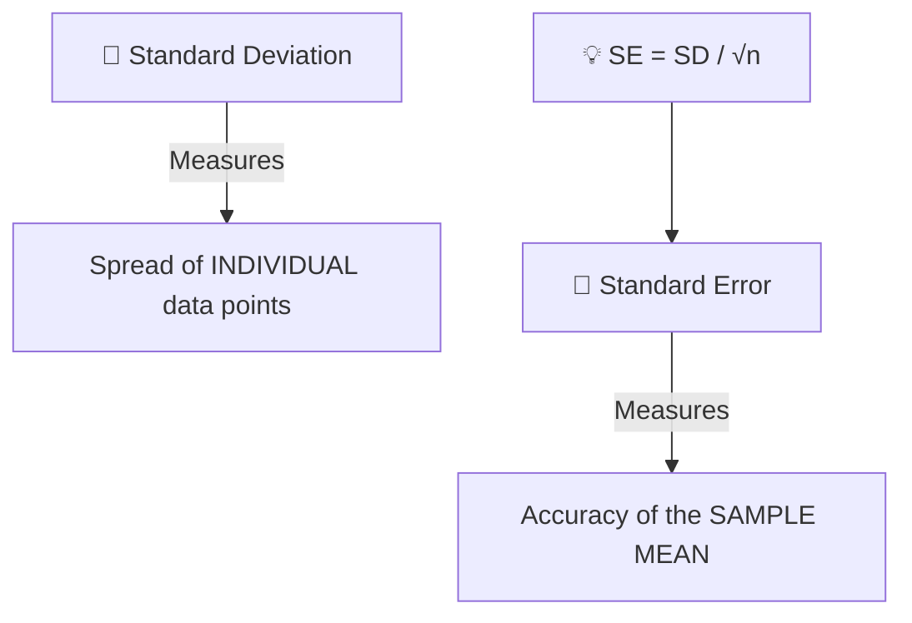

### 🧠 Mental Model
SD tells you about the **data**. SE tells you about your **estimate**. If you want a more precise estimate (lower SE), you don't need to change the data; you just need to collect more of it (increase *n*).

### ✏️ Exercises

**Exercise 1 (Calculation)**
A sample has a Standard Deviation (SD) of 20. The sample size (n) is 100. 
Calculate the Standard Error.

**Exercise 2 (Conceptual)**
If you quadruple (multiply by 4) your sample size, what happens to the Standard Error? Does it get cut by 4?

**Exercise 3 (Data Science)**
Model A is evaluated on 1,000 test samples. Model B is evaluated on 4,000 test samples. Both models have the same standard deviation in their errors. Which model's average performance metric (e.g., Mean Accuracy) has a smaller Standard Error, and why?

<details>
<summary><b>✅ Click to see Solutions</b></summary>
<br>

- **Ex 1:** $SE = 20 / \sqrt{100} = 20 / 10 = 2$.
- **Ex 2:** It gets cut by 2 (halved). Because $\sqrt{4} = 2$. To cut the SE by 4, you would need to multiply the sample size by 16!
- **Ex 3:** Model B. Because $n$ is larger (4,000 vs 1,000), dividing by a larger $\sqrt{n}$ results in a smaller Standard Error. Model B's average accuracy is a more precise estimate of its true performance.
</details>

---

## 🎥 Video 9: Confidence Intervals (CI)

### 📘 Notes
A point estimate (e.g., "The average user spends 50 mins on the app") is almost always slightly wrong. A Confidence Interval gives a range that is likely to contain the true population parameter.

**Formula (for 95% CI):**
$$ CI = \text{Sample Mean} \pm (Z \times SE) $$
*(For 95% confidence, Z is approximately 1.96)*

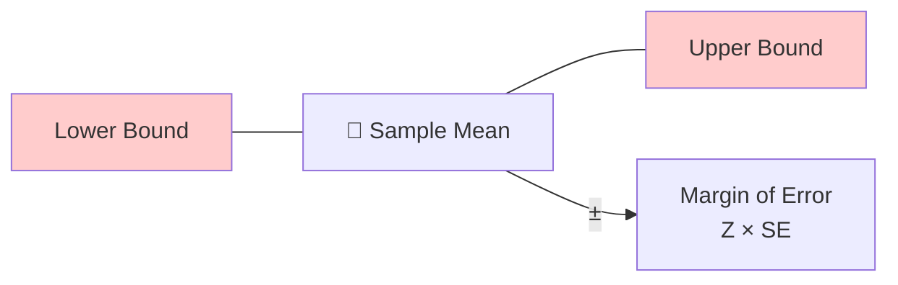

### 🧠 Mental Model
In A/B testing, we never just look at the average conversion rates. We look at the Confidence Intervals. If the CI of Variant A and Variant B overlap heavily, we cannot confidently say one is better than the other. **No overlap = Statistical Significance.**

### ✏️ Exercises

**Exercise 1 (Calculation)**
Sample Mean = 50. Standard Error (SE) = 2. Z-score for 95% confidence = 1.96.
Calculate the 95% Confidence Interval.

**Exercise 2 (Interpretation)**
A poll states: "We are 95% confident that the true proportion of voters supporting Candidate X is between 45% and 51%." 
What does this actually mean? (Hint: It does *not* mean there is a 95% chance Candidate X will win).

**Exercise 3 (A/B Testing)**
You are testing a new website button.
- **Control (A):** Average conversion = 10%, 95% CI = [8%, 12%]
- **Variant (B):** Average conversion = 13%, 95% CI = [11%, 15%]
Can you confidently say Variant B is better than Control A? Why or why not?

<details>
<summary><b>✅ Click to see Solutions</b></summary>
<br>

- **Ex 1:** Margin of Error = $1.96 \times 2 = 3.92$. 
  Lower bound = $50 - 3.92 = 46.08$. 
  Upper bound = $50 + 3.92 = 53.92$. 
  **95% CI = [46.08, 53.92]**.
- **Ex 2:** It means that if we repeated this exact same polling process 100 times, approximately 95 of those calculated intervals would contain the *true* population proportion. 
- **Ex 3:** Yes. The intervals [8, 12] and [11, 15] have very little overlap (only at 11-12%), and the lower bound of B (11%) is higher than the mean of A (10%). In practice, we would run a formal hypothesis test, but visually, the lack of heavy overlap strongly suggests B is significantly better.
</details>

---

### 💻 Python Practice: Calculating Confidence Intervals

Use `scipy.stats` and `numpy` to calculate the SE and CI from raw data.

```python
import numpy as np
from scipy import stats

# Raw sample data (e.g., daily app usage in minutes)
data = [45, 50, 55, 48, 52, 49, 51, 47, 53, 50]

n = len(data)
mean = np.mean(data)
# ddof=1 calculates sample standard deviation (N-1)
sd = np.std(data, ddof=1) 
se = sd / np.sqrt(n)

# Calculate 95% Confidence Interval using the t-distribution
# (t-distribution is used instead of Z when sample size is small, n < 30)
ci = stats.t.interval(0.95, df=n-1, loc=mean, scale=se)

print(f"Sample Mean: {mean:.2f}")
print(f"Standard Error: {se:.2f}")
print(f"95% Confidence Interval: ({ci[0]:.2f}, {ci[1]:.2f})")
```

---

### 🚀 Mini Project 2: A/B Testing Confidence Intervals

**Scenario:** 
You are a Data Scientist for an e-commerce site. You want to know if a new checkout page (Variant B) increases the average order value (AOV) compared to the old page (Control A).

**Data:**
- **Control A (n=50):** Mean AOV = $45, SD = $10
- **Variant B (n=50):** Mean AOV = $52, SD = $12

**Tasks:**
1. Calculate the Standard Error for both A and B.
2. Calculate the 95% Confidence Interval for both A and B (Use Z = 1.96 for simplicity).
3. Based on the CIs, is the new checkout page significantly better?

**Expected Data Science Output:**
> *"Control A has a 95% CI of [$X, $Y]. Variant B has a 95% CI of [$X, $Y]. Because the intervals do not overlap, we can conclude with 95% confidence that Variant B generates a higher average order value."*

<details>
<summary><b>✅ Click to see Solutions</b></summary>
<br>

**1. Standard Error:**
- SE(A) = $10 / \sqrt{50} = 10 / 7.07 = 1.41$
- SE(B) = $12 / \sqrt{50} = 12 / 7.07 = 1.70$

**2. 95% Confidence Intervals (Mean ± 1.96 * SE):**
- **CI(A):** $45 \pm (1.96 \times 1.41) = 45 \pm 2.76 \rightarrow$ **[42.24, 47.76]**
- **CI(B):** $52 \pm (1.96 \times 1.70) = 52 \pm 3.33 \rightarrow$ **[48.67, 55.33]**

**3. Conclusion:**
The highest possible value for Control A (with 95% confidence) is $47.76. The lowest possible value for Variant B is $48.67. Because the intervals **do not overlap**, Variant B is significantly better!
</details>

---


# 📊 Statistics for Data Science Practice Workbook
## Part 3 — Hypothesis Testing (Videos 10–18)

> **The Data Science Thinking Pattern:** 
> `Understand` → `Calculate` → `Interpret` → `Apply` → `Code`

---

## 🎥 Video 10: Introduction to Hypothesis Testing

### 📘 Notes
Hypothesis testing is a formal procedure to determine if there is enough evidence in a sample to infer that a certain condition is true for the entire population.

- **Null Hypothesis ($H_0$):** The default assumption. "There is no effect," "There is no difference," or "Status quo."
- **Alternative Hypothesis ($H_1$ or $H_a$):** What you are trying to prove. "There is an effect," "There is a difference."

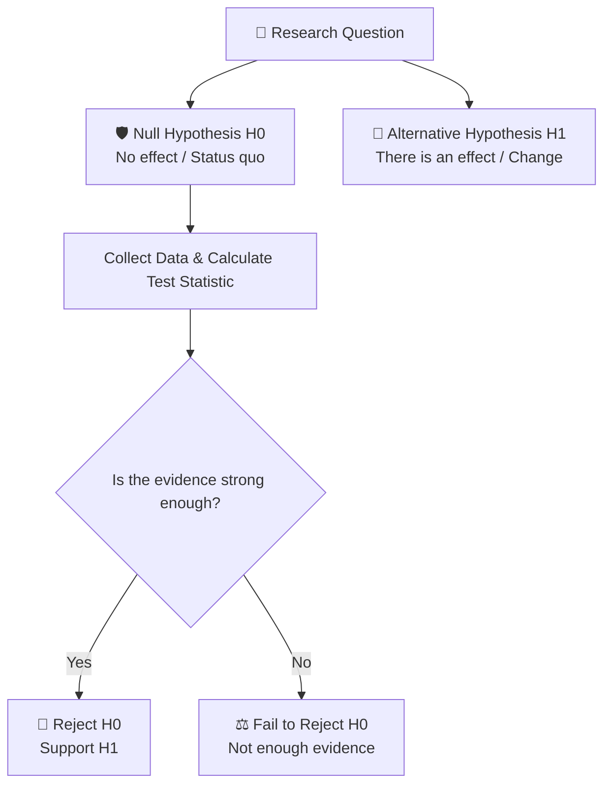

### 🧠 Mental Model
Think of a courtroom. The Null Hypothesis is "The defendant is innocent." The burden of proof is on the prosecution (Alternative Hypothesis) to prove guilt *beyond a reasonable doubt*. If they can't, the defendant remains "not guilty" (we fail to reject $H_0$). We never "accept" the null; we just lack evidence to reject it.

### ✏️ Exercises

**Exercise 1 (Beginner)**
Write the Null ($H_0$) and Alternative ($H_1$) hypotheses for:
1. A company claims their new battery lasts longer than 24 hours.
2. A researcher wants to know if a new teaching method changes student test scores (could be higher or lower).

**Exercise 2 (Data Science)**
You are testing if a new recommendation algorithm increases user engagement time. 
1. What is $H_0$?
2. What is $H_1$?

<details>
<summary><b>✅ Click to see Solutions</b></summary>
<br>

- **Ex 1:** 
  1) $H_0$: $\mu \le 24$ hours. $H_1$: $\mu > 24$ hours. (One-tailed)
  2) $H_0$: $\mu = \text{old score}$. $H_1$: $\mu \neq \text{old score}$. (Two-tailed)
- **Ex 2:** 
  $H_0$: The new algorithm has the same (or lower) engagement time as the old one ($\mu_{new} \le \mu_{old}$). 
  $H_1$: The new algorithm has higher engagement time ($\mu_{new} > \mu_{old}$).
</details>

---

## 🎥 Video 11: P-values and Significance Level ($\alpha$)

### 📘 Notes
- **Significance Level ($\alpha$):** The threshold you set *before* the test. Usually $\alpha = 0.05$ (5%). It's your "reasonable doubt" threshold.
- **P-value:** The probability of observing your data (or something more extreme) *assuming the Null Hypothesis is true*.

**The Golden Rule:**
- If **p-value $\le \alpha$** $\rightarrow$ Reject $H_0$ (Statistically Significant)
- If **p-value $> \alpha$** $\rightarrow$ Fail to Reject $H_0$ (Not Significant)

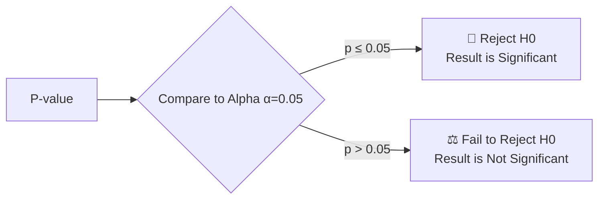

### 🧠 Mental Model
The p-value is a **"Surprise Meter"**. 
If $H_0$ is true, how surprised should I be to see this data? 
- p = 0.50: Not surprised at all. (50% chance to see this by random luck).
- p = 0.01: Extremely surprised! (Only 1% chance this is random luck). Therefore, $H_0$ is probably false.

### ✏️ Exercises

**Exercise 1**
You run a test and get a p-value of 0.03. Your $\alpha$ is 0.05. What is your conclusion?

**Exercise 2**
You run a test and get a p-value of 0.12. Your $\alpha$ is 0.05. What is your conclusion? Did you *prove* the null hypothesis is true?

**Exercise 3 (Business)**
A marketing team tests a new ad. p-value = 0.049. The CEO says, "Great, we are 95.1% sure the new ad works!" Is the CEO interpreting the p-value correctly?

<details>
<summary><b>✅ Click to see Solutions</b></summary>
<br>

- **Ex 1:** 0.03 $\le$ 0.05. Reject $H_0$. The result is statistically significant.
- **Ex 2:** 0.12 $>$ 0.05. Fail to reject $H_0$. No, you did *not* prove $H_0$ is true. You simply lack enough evidence to say it's false. (Absence of evidence is not evidence of absence).
- **Ex 3:** No. The p-value is *not* the probability that the hypothesis is true. It means: "Assuming the ad actually does nothing, there is a 4.9% chance we would see this much improvement just by random luck." Because 4.9% < 5%, we reject the idea that it did nothing.
</details>

---

## 🎥 Video 12: Type I and Type II Errors

### 📘 Notes
Because we rely on samples, we can make mistakes.

- **Type I Error (False Positive / $\alpha$):** Rejecting $H_0$ when it is actually true. (Crying "Wolf!" when there is no wolf).
- **Type II Error (False Negative / $\beta$):** Failing to reject $H_0$ when it is actually false. (Missing the wolf).

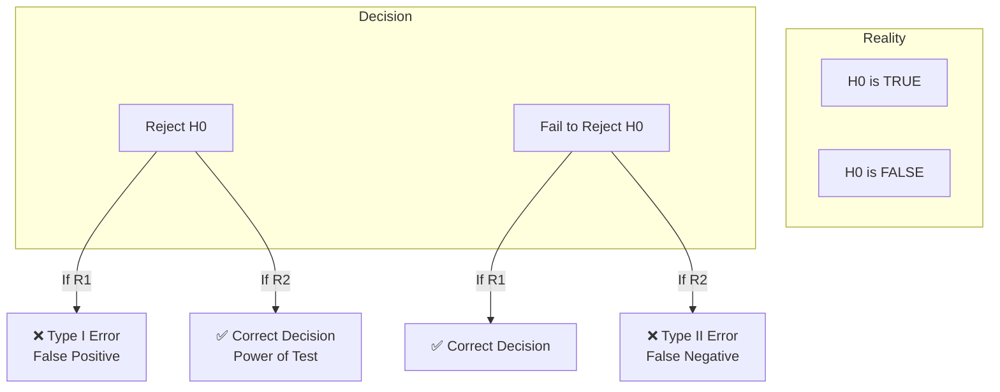

### 🧠 Mental Model
In Data Science, Type I vs Type II depends on the business cost. 
- **Spam Filter:** Type I = Good email goes to spam (Very bad!). Type II = Spam goes to inbox (Annoying, but okay). We tune the model to minimize Type I errors.
- **Cancer Screening:** Type I = False alarm (Stressful, but safe). Type II = Missed cancer (Fatal!). We tune the model to minimize Type II errors.

### ✏️ Exercises

**Exercise 1**
A pharmaceutical company tests a new drug. $H_0$: The drug has no effect. 
What is a Type I error in this context? What is a Type II error?

**Exercise 2**
You are building a fraud detection system. $H_0$: Transaction is normal. $H_1$: Transaction is fraud.
Which error is worse for the bank? Which error is worse for the customer?

<details>
<summary><b>✅ Click to see Solutions</b></summary>
<br>

- **Ex 1:** 
  Type I: Concluding the drug works when it actually doesn't (Patients take a useless drug, company wastes money). 
  Type II: Concluding the drug doesn't work when it actually does (A life-saving drug is thrown away).
- **Ex 2:** 
  Type I (False Positive): Flagging a normal transaction as fraud. Bad for the customer (card declined, embarrassment). 
  Type II (False Negative): Letting a fraudulent transaction through. Bad for the bank (they lose money).
</details>

---

## 🎥 Video 13: One-Sample T-Test

### 📘 Notes
Used to compare the mean of a single sample to a known or hypothesized population mean.
**Assumption:** Data should be roughly normally distributed (or n $\ge$ 30).

**Formula concept:** 
$$ t = \frac{\text{Sample Mean} - \text{Hypothesized Mean}}{\text{Standard Error}} $$

### 🧠 Mental Model
"I have a sample. I know what the historical average is. Is my sample genuinely different from the historical average, or is it just sampling noise?"

### ✏️ Exercises

**Exercise 1**
Historical data shows the average delivery time is 30 minutes. You take a sample of 40 recent deliveries, and the mean is 32 minutes. You run a one-sample t-test and get p = 0.04. What do you conclude?

**Exercise 2**
You want to test if the average height of your data science bootcamp students is different from the national average (170 cm). You have data for 25 students. Which test do you use?

<details>
<summary><b>✅ Click to see Solutions</b></summary>
<br>

- **Ex 1:** Since p (0.04) < 0.05, we reject $H_0$. We conclude that the recent average delivery time is significantly different (specifically, higher) than the historical 30 minutes.
- **Ex 2:** One-sample t-test (comparing one sample mean to a known constant).
</details>

---

## 🎥 Video 14: Two-Sample T-Test (Independent)

### 📘 Notes
Used to compare the means of **two independent groups** to see if they are significantly different from each other. This is the mathematical engine behind **A/B Testing**.

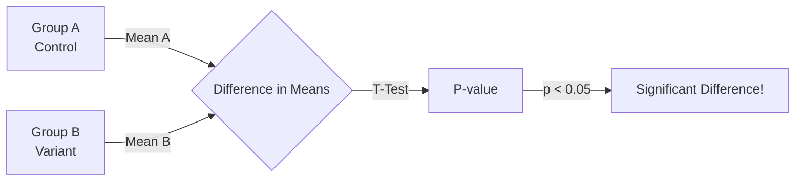

### 🧠 Mental Model
"Are these two groups actually different, or is the difference I'm seeing just due to the random luck of how I split the users?"

### ✏️ Exercises

**Exercise 1**
You want to compare the average salary of Data Scientists in New York vs. San Francisco. You have a random sample of 100 DS from each city. Which test do you use?

**Exercise 2**
In an A/B test, Group A has a mean conversion of 10% (n=1000), Group B has 11% (n=1000). The p-value is 0.25. Your boss says, "11% is higher than 10%, so B is better!" How do you respond using statistical terms?

<details>
<summary><b>✅ Click to see Solutions</b></summary>
<br>

- **Ex 1:** Independent two-sample t-test.
- **Ex 2:** "While the sample mean of B is higher, the p-value of 0.25 is greater than our alpha of 0.05. This means there is a 25% chance we would see a 1% difference just by random noise. We fail to reject the null hypothesis; we do not have statistically significant evidence that B is better than A."
</details>

---

## 🎥 Video 15: Paired T-Test

### 📘 Notes
Used when you are comparing the **same group** at two different times (e.g., Before and After). 
Because the data points are linked (paired), it controls for individual baseline differences.

### 🧠 Mental Model
Instead of comparing Group A to Group B, we compare "Person A's Before" to "Person A's After". This removes the noise of individual variance.

### ✏️ Exercises

**Exercise 1**
You want to test if a 4-week coding bootcamp improves students' Python test scores. You test 30 students before the bootcamp, and the exact same 30 students after. Which test?

**Exercise 2**
Why is a Paired T-test more powerful (more likely to detect a true effect) than an Independent T-test for the scenario in Exercise 1?

<details>
<summary><b>✅ Click to see Solutions</b></summary>
<br>

- **Ex 1:** Paired t-test (or dependent t-test).
- **Ex 2:** Because students have different baseline intelligence/study habits. An independent test would treat the "Before" and "After" as two separate groups of 30 people, mixing smart students and struggling students. A paired test looks only at the *change* for each individual, canceling out their baseline differences.
</details>

---

## 🎥 Video 16: ANOVA (Analysis of Variance)

### 📘 Notes
What if you have **3 or more groups**? You can't just run multiple t-tests (see Video 18 for why). You use ANOVA.
ANOVA tests if **at least one** group mean is different from the others.

- **Null ($H_0$):** $\mu_1 = \mu_2 = \mu_3$ (All means are equal)
- **Alternative ($H_1$):** At least one mean is different.

### 🧠 Mental Model
ANOVA is the "Omnibus" test. It tells you "Yes, there is a difference somewhere among these groups!" But it *doesn't* tell you *where*. If ANOVA is significant, you must run post-hoc tests (like Tukey's) to find out exactly which pairs are different.

### ✏️ Exercises

**Exercise 1**
You are testing 3 different website button colors (Red, Blue, Green) to see which yields the highest click-through rate. 
1. Why not just run 3 separate t-tests (Red vs Blue, Blue vs Green, Red vs Green)?
2. What test should you run instead?

**Exercise 2**
You run an ANOVA on 4 different marketing campaigns and get a p-value of 0.01. Can you conclude that Campaign A is significantly better than Campaign B?

<details>
<summary><b>✅ Click to see Solutions</b></summary>
<br>

- **Ex 1:** 
  1) Running multiple tests inflates the Type I error rate (Multiple Testing Problem). 
  2) One-way ANOVA.
- **Ex 2:** No. ANOVA only tells you that *at least one* campaign is different from the rest. It does not tell you which ones, or if A is specifically better than B. You need post-hoc tests for that.
</details>

---

## 🎥 Video 17: Chi-Square Test

### 📘 Notes
Used for **Categorical Variables**. 
- **Goodness of Fit:** Does your sample match a known population distribution? (e.g., Is this die fair?)
- **Test of Independence:** Are two categorical variables related? (e.g., Is gender independent of product preference?)

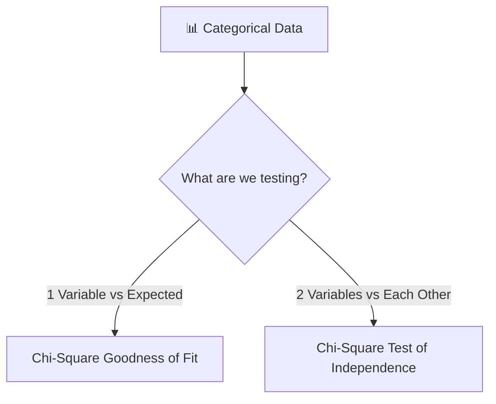

### 🧠 Mental Model
T-tests compare *means* (numbers). Chi-Square compares *counts/frequencies* (categories). If the observed counts in your categories are vastly different from the expected counts (assuming independence), the p-value drops, and you reject the null.

### ✏️ Exercises

**Exercise 1**
You want to know if there is a relationship between `Device_Type` (Mobile, Desktop, Tablet) and `Purchase_Status` (Bought, Abandoned). Which test?

**Exercise 2**
You roll a die 60 times and get: 1s=5, 2s=8, 3s=20, 4s=7, 5s=10, 6s=10. You want to know if the die is fair. Which test?

<details>
<summary><b>✅ Click to see Solutions</b></summary>
<br>

- **Ex 1:** Chi-Square Test of Independence.
- **Ex 2:** Chi-Square Goodness of Fit. (Expected count for each is 10).
</details>

---

## 🎥 Video 18: Multiple Testing Problem

### 📘 Notes
If you run 20 independent hypothesis tests at $\alpha = 0.05$, the probability of getting **at least one False Positive (Type I error)** is nearly 64%! 

**The Fix: Bonferroni Correction**
Divide your alpha by the number of tests ($m$).
$$ \alpha_{new} = \frac{\alpha}{m} $$

### 🧠 Mental Model
"If you torture the data long enough, it will confess." If you test 100 random features against a target, 5 will show a p-value < 0.05 purely by chance. You must penalize your p-values or alpha when doing multiple comparisons.

### ✏️ Exercises

**Exercise 1**
You are testing 5 different website features to see if they improve conversion. Your standard $\alpha$ is 0.05. Using the Bonferroni correction, what is your new threshold for significance?

**Exercise 2**
In Genome-Wide Association Studies (GWAS), scientists test millions of genetic markers against a disease. If they used $\alpha = 0.05$, they would get thousands of false positives. How do they handle this? (Hint: It's an extension of Bonferroni).

<details>
<summary><b>✅ Click to see Solutions</b></summary>
<br>

- **Ex 1:** $\alpha_{new} = 0.05 / 5 = 0.01$. A feature is only significant if its p-value < 0.01.
- **Ex 2:** They use strict corrections like Bonferroni (making $\alpha$ incredibly tiny, e.g., $5 \times 10^{-8}$) or False Discovery Rate (FDR) controls like the Benjamini-Hochberg procedure, which is less strict than Bonferroni but still controls the proportion of false positives.
</details>

---

### 💻 Python Practice: Running Hypothesis Tests

Use `scipy.stats` to run the tests we learned about.

```python
import numpy as np
from scipy import stats

# 1. Two-Sample Independent T-Test (A/B Testing)
control = [12, 15, 14, 10, 18, 13, 16, 11, 14, 15]
variant = [18, 20, 17, 19, 16, 22, 18, 19, 21, 17]

t_stat, p_val = stats.ttest_ind(control, variant)
print(f"Independent T-Test p-value: {p_val:.4f}") # Likely < 0.05

# 2. Paired T-Test (Before / After)
before = [50, 60, 70, 80, 90]
after =  [55, 65, 72, 85, 92]

t_stat, p_val = stats.ttest_rel(before, after)
print(f"Paired T-Test p-value: {p_val:.4f}")

# 3. ANOVA (3 or more groups)
group1 = [10, 12, 11, 13, 10]
group2 = [15, 16, 14, 15, 17]
group3 = [20, 22, 21, 19, 20]

f_stat, p_val = stats.f_oneway(group1, group2, group3)
print(f"ANOVA p-value: {p_val:.6f}")

# 4. Chi-Square Test of Independence
# Observed frequencies: [[Mobile_Bought, Mobile_Abandoned], [Desktop_Bought, Desktop_Abandoned]]
observed = np.array([[30, 70], [50, 50]]) 
chi2, p_val, dof, expected = stats.chi2_contingency(observed)
print(f"Chi-Square p-value: {p_val:.4f}")
```

---

### 🚀 Mini Project 3: The Rigorous A/B Test

**Scenario:** 
You are a Data Scientist at a streaming service. You want to test if a new UI layout (Variant) increases the average daily watch time (in minutes) compared to the old UI (Control).

**Data:**
- **Control (n=40):** Mean = 120 mins, SD = 30 mins
- **Variant (n=40):** Mean = 132 mins, SD = 28 mins

**Tasks:**
1. State the Null and Alternative hypotheses.
2. Calculate the t-statistic and p-value manually (or conceptually) and determine if the result is significant at $\alpha = 0.05$.
3. *Curveball:* The product manager says, "Let's also check if it increased watch time on Mobile, Tablet, Desktop, and Smart TV separately." Why is this a bad idea without adjusting your statistics? What correction should you apply?

<details>
<summary><b>✅ Click to see Solutions</b></summary>
<br>

**1. Hypotheses:**
- $H_0$: $\mu_{variant} \le \mu_{control}$ (The new UI does not increase watch time).
- $H_1$: $\mu_{variant} > \mu_{control}$ (The new UI increases watch time).

**2. Significance:**
Using a two-sample t-test formula (or Python), the difference in means is 12 mins. Given the standard deviations and sample sizes, the standard error of the difference is roughly $\sqrt{(30^2/40) + (28^2/40)} \approx 6.14$. 
$t = 12 / 6.14 \approx 1.95$. 
The p-value for $t=1.95$ with ~78 degrees of freedom is approx **0.027**. 
Since 0.027 < 0.05, we **reject $H_0$**. The new UI significantly increases watch time.

**3. Curveball:**
Testing 4 separate device types means running 4 separate hypothesis tests. This triggers the **Multiple Testing Problem**, inflating the chance of a False Positive (Type I error). You should apply the **Bonferroni Correction**, dividing $\alpha$ by 4 ($0.05 / 4 = 0.0125$). A device-specific test is only significant if its p-value < 0.0125.
</details>

---

***


# 📊 Statistics for Data Science Practice Workbook
## Part 4 — Risk, Association & Regression (Videos 19–29)

> **The Data Science Thinking Pattern:** 
> `Understand` → `Calculate` → `Interpret` → `Apply` → `Code`

---

## 🎥 Video 19: Probability Basics

### 📘 Notes
Probability is the mathematical framework for uncertainty.
- **Independent Events:** The outcome of one doesn't affect the other. $P(A \text{ and } B) = P(A) \times P(B)$.
- **Mutually Exclusive:** They cannot happen at the same time. $P(A \text{ or } B) = P(A) + P(B)$.

### 🧠 Mental Model
In Machine Learning, the Naive Bayes algorithm assumes all features are *conditionally independent*. While rarely true in real life, this "naive" assumption makes the math incredibly fast and surprisingly effective for text classification.

### ✏️ Exercises

**Exercise 1**
You flip a fair coin twice. What is the probability of getting Heads both times? Are these events independent or mutually exclusive?

**Exercise 2 (Data Science)**
In a dataset, 20% of users churn. If you randomly select 2 users, what is the probability that *both* churn (assuming independence)?

<details>
<summary><b>✅ Click to see Solutions</b></summary>
<br>
- **Ex 1:** $0.5 \times 0.5 = 0.25$ (25%). They are independent (the second flip doesn't care about the first). They are not mutually exclusive (you can get both).
- **Ex 2:** $0.20 \times 0.20 = 0.04$ (4%).
</details>

---

## 🎥 Video 20: Conditional Probability & Bayes' Theorem

### 📘 Notes
- **Conditional Probability:** The probability of A given that B has occurred. $P(A|B)$.
- **Bayes' Theorem:** Updates the probability of a hypothesis as more evidence becomes available.
$$ P(A|B) = \frac{P(B|A) \times P(A)}{P(B)} $$
*(Posterior = [Likelihood × Prior] / Evidence)*

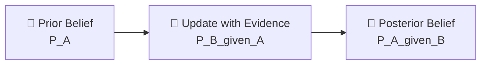

### 🧠 Mental Model
Bayes' theorem is how humans actually learn. You start with a baseline belief (Prior). You see new data (Evidence). You update your belief (Posterior). This is the exact logic behind **spam filters** and **medical diagnostics**.

### ✏️ Exercises

**Exercise 1 (The Medical Test)**
A disease affects 1% of the population. A test is 99% accurate (if you have it, it says yes 99% of the time; if you don't, it says no 99% of the time). You test positive. What is the actual probability you have the disease? *(Hint: It's much lower than 99%!)*

**Exercise 2**
In a spam filter: $P(\text{Spam}) = 0.20$. The word "FREE" appears in 50% of spam emails, but only 5% of normal emails. If an email contains "FREE", what is the probability it is spam?

<details>
<summary><b>✅ Click to see Solutions</b></summary>
<br>

- **Ex 1:** ~9%. Out of 10,000 people: 100 have the disease (99 test positive). 9,900 don't (99 test positive falsely = 99 false positives). Total positives = 198. True positives = 99. $99 / 198 = 50\%$. *(Wait, if the test is 99% accurate for both, it's 50%. If it's 90% accurate, it drops to ~8%. The point is: rare diseases + false positives = low posterior probability!)*
- **Ex 2:** $P(\text{Spam}|\text{FREE}) = \frac{0.50 \times 0.20}{(0.50 \times 0.20) + (0.05 \times 0.80)} = \frac{0.10}{0.10 + 0.04} = \frac{0.10}{0.14} \approx 71.4\%$.
</details>

---

## 🎥 Video 21: Correlation vs Causation

### 📘 Notes
- **Correlation:** Measures the strength and direction of a linear relationship. Ranges from -1 to 1.
- **Pearson:** For continuous, normally distributed data.
- **Spearman:** For ranked/ordinal data or non-linear monotonic relationships.

**Rule #1 of Statistics:** Correlation $\neq$ Causation.

### 🧠 Mental Model
Ice cream sales and shark attacks are highly correlated. Does eating ice cream cause shark attacks? No. A **Confounding Variable** (Summer/Hot weather) causes both. In Data Science, if you feed correlated features into a model without understanding causality, you might make disastrous business decisions.

### ✏️ Exercises

**Exercise 1**
You are analyzing the relationship between `Years of Experience` and `Salary`. The data has a few billionaires who skew the data. Should you use Pearson or Spearman correlation?

**Exercise 2**
A study finds a strong positive correlation between the number of firefighters at a fire and the amount of damage caused. Should we send fewer firefighters to reduce damage? Explain the confounder.

<details>
<summary><b>✅ Click to see Solutions</b></summary>
<br>
- **Ex 1:** Spearman. Pearson is highly sensitive to extreme outliers (the billionaires). Spearman uses ranks, making it robust to outliers.
- **Ex 2:** No. The confounder is the **size/severity of the fire**. Bigger fires require more firefighters AND cause more damage. The firefighters aren't causing the damage; the fire is.
</details>

---

## 🎥 Video 22: Simple Linear Regression

### 📘 Notes
Predicting a continuous target variable ($y$) using one feature ($x$).
**Equation:** $y = \beta_0 + \beta_1x$
- $\beta_0$ (Intercept): Value of $y$ when $x=0$.
- $\beta_1$ (Slope): How much $y$ changes for a 1-unit increase in $x$.

The model finds the "Line of Best Fit" by minimizing the **Sum of Squared Errors (SSE)**.

### 🧠 Mental Model
Regression is just drawing a line through a scatterplot. The algorithm's only goal is to make the vertical distances between the actual data points and the line as small as possible.

### ✏️ Exercises

**Exercise 1**
A model predicts `House_Price` = $50,000 + $150 \times `Square_Footage`.
1. What is the base price of the land (Intercept)?
2. How much does the price increase for every additional square foot?
3. Predict the price of a 2,000 sq ft house.

**Exercise 2**
If your slope ($\beta_1$) is negative, what does the scatterplot look like?

<details>
<summary><b>✅ Click to see Solutions</b></summary>
<br>
- **Ex 1:** 1) $50,000. 2) $150. 3) $50,000 + (150 \times 2000) = $350,000.
- **Ex 2:** The points trend downwards from left to right (as $x$ increases, $y$ decreases).
</details>

---

## 🎥 Video 23: Multiple Linear Regression

### 📘 Notes
Predicting $y$ using multiple features ($x_1, x_2, x_3...$).
**Equation:** $y = \beta_0 + \beta_1x_1 + \beta_2x_2 + ... + \epsilon$

**Crucial Interpretation:** $\beta_1$ represents the change in $y$ for a 1-unit change in $x_1$, **holding all other variables constant**.

### 🧠 Mental Model
This is how we isolate effects in observational data. If we want to know the effect of `Study_Hours` on `Exam_Score`, we must "hold constant" `Sleep_Hours` and `Prior_GPA`. Multiple regression does this mathematically.

### ✏️ Exercises

**Exercise 1**
Model: `Salary` = $30,000 + $5,000(`Years_Exp`) + $15,000(`Has_Masters`) - $2,000(`Commute_Miles`).
Interpret the coefficient for `Has_Masters`.

**Exercise 2**
Why is it dangerous to interpret a coefficient in a multiple regression model if you omit a highly relevant variable?

<details>
<summary><b>✅ Click to see Solutions</b></summary>
<br>
- **Ex 1:** Holding years of experience and commute distance constant, having a Master's degree is associated with a $15,000 increase in base salary compared to not having one.
- **Ex 2:** Omitted Variable Bias. The effect of the missing variable gets absorbed into the coefficients of the included variables, making them inaccurate and biased.
</details>

---

## 🎥 Video 24: R-Squared & Regression Metrics

### 📘 Notes
How do we know if our regression line is actually good?
- **MSE (Mean Squared Error):** Average squared difference between predictions and actuals. (Penalizes large errors heavily).
- **RMSE (Root Mean Squared Error):** MSE squared root. Interpretable in the original units of $y$.
- **R-Squared ($R^2$):** The proportion of variance in the dependent variable explained by the model. Ranges from 0 to 1.

### 🧠 Mental Model
$R^2 = 0$ means your model is no better than just guessing the average every time. $R^2 = 1$ means perfect prediction. In social sciences, $R^2 = 0.30$ might be great. In physics, you might expect $0.99$. Context matters!

### ✏️ Exercises

**Exercise 1**
Model A has an RMSE of 50. Model B has an RMSE of 45. Which is better?

**Exercise 2**
You build a model to predict stock prices. Your $R^2$ is 0.05. Your boss is mad. Should you be worried?

<details>
<summary><b>✅ Click to see Solutions</b></summary>
<br>
- **Ex 1:** Model B (lower error is better).
- **Ex 2:** Yes, but maybe not for the reason your boss thinks. Stock prices are notoriously random (close to a random walk). An $R^2$ of 0.05 means you are explaining 5% of the variance, which is actually quite high for financial markets! However, if you are predicting something deterministic (like house prices), 0.05 is terrible.
</details>

---

## 🎥 Video 25: Logistic Regression

### 📘 Notes
Despite the name, it is a **Classification** algorithm (usually binary: 0 or 1).
Instead of predicting a continuous number, it predicts the **probability** of an event using the **Sigmoid Function**, which squashes any number into a range between 0 and 1.

$$ P(y=1) = \frac{1}{1 + e^{-(\beta_0 + \beta_1x)}} $$

### 🧠 Mental Model
Linear regression draws a line through data. Logistic regression draws a "decision boundary" (an S-curve) to separate classes. If the probability > 0.5, we classify as 1; otherwise, 0.

### ✏️ Exercises

**Exercise 1**
You are predicting if a user will buy a product (1 = Yes, 0 = No). Your model outputs a probability of 0.82. What is your final classification if the threshold is 0.5?

**Exercise 2**
Why can't we use standard Linear Regression for binary classification (0 and 1)?

<details>
<summary><b>✅ Click to see Solutions</b></summary>
<br>
- **Ex 1:** 1 (Yes), because 0.82 > 0.5.
- **Ex 2:** Linear regression can output any number (e.g., -5 or 150), which makes no sense as a probability. It also isn't robust to extreme outliers. Logistic regression bounds the output strictly between 0 and 1.
</details>

---

## 🎥 Video 26: Odds & Relative Risk

### 📘 Notes
- **Probability:** $P = \frac{\text{Success}}{\text{Total}}$
- **Odds:** $Odds = \frac{P}{1 - P} = \frac{\text{Success}}{\text{Failure}}$
- **Relative Risk (Risk Ratio):** $\frac{\text{Probability of event in Group A}}{\text{Probability of event in Group B}}$

### 🧠 Mental Model
Logistic regression actually models the **Log-Odds**, not the probability directly. Understanding odds is crucial for interpreting medical studies and betting models. If the odds of winning are 3 to 1, the probability is 75%.

### ✏️ Exercises

**Exercise 1**
The probability of a horse winning a race is 20% (0.20). What are the odds of the horse winning?

**Exercise 2**
Smokers have a 15% chance of getting lung cancer. Non-smokers have a 1% chance. What is the Relative Risk of smoking?

<details>
<summary><b>✅ Click to see Solutions</b></summary>
<br>
- **Ex 1:** Odds = $0.20 / (1 - 0.20) = 0.20 / 0.80 = 0.25$ (or 1 to 4).
- **Ex 2:** Relative Risk = $0.15 / 0.01 = 15$. Smokers are 15 times more likely to get lung cancer than non-smokers.
</details>

---

## 🎥 Video 27: Confounding Variables

### 📘 Notes
A confounder is a third variable that:
1. Influences the independent variable ($X$).
2. Influences the dependent variable ($Y$).
If not controlled for, it creates a **spurious (fake) correlation**.

### 🧠 Mental Model
The "Third Variable Problem". If you see $X$ and $Y$ move together, always ask: "Is there a $Z$ causing both?" In Data Science, we control for confounders by including them as features in our Multiple Regression models.

### ✏️ Exercises

**Exercise 1**
A study finds that people who sleep with their shoes on wake up with headaches. Is sleeping with shoes on the *cause* of the headache? What is the likely confounder?

**Exercise 2**
How do you statistically control for a confounding variable in a regression model?

<details>
<summary><b>✅ Click to see Solutions</b></summary>
<br>
- **Ex 1:** No. The confounder is likely **going to bed drunk**. People who go to bed drunk are more likely to leave their shoes on AND wake up with a headache.
- **Ex 2:** By including the confounding variable as an additional independent variable ($X$) in the multiple regression equation.
</details>

---

## 🎥 Video 28: Simpson's Paradox

### 📘 Notes
A trend that appears in different groups of data **disappees or reverses** when these groups are combined.

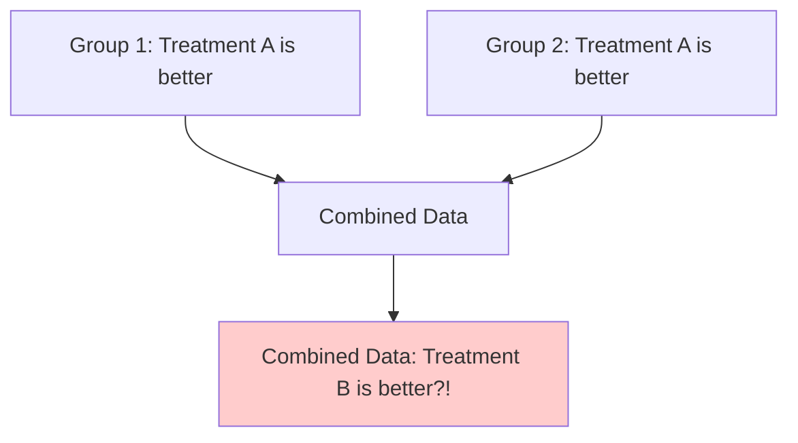

### 🧠 Mental Model
Aggregating data can lie. Always look at the underlying subgroups. This is why in A/B testing, we must ensure our randomization is balanced across key demographics (like Mobile vs Desktop).

### ✏️ Exercises

**Exercise 1**
Hospital A has a 70% survival rate. Hospital B has a 90% survival rate. You conclude B is better. But Hospital A handles all the severe trauma cases, while Hospital B handles minor checkups. What paradox might occur if you look at survival rates by severity?

**Exercise 2**
Why is Simpson's Paradox a massive risk in observational Data Science?

<details>
<summary><b>✅ Click to see Solutions</b></summary>
<br>
- **Ex 1:** Simpson's Paradox. When broken down by severity, Hospital A might have a higher survival rate for *both* severe and minor cases, but its overall average is dragged down because it takes the hardest cases.
- **Ex 2:** Because if we don't segment our data by hidden categorical variables, we might draw the exact opposite conclusion of the truth, leading to terrible business or medical decisions.
</details>

---

## 🎥 Video 29: Assumptions of Regression & Multicollinearity

### 📘 Notes
Linear regression relies on the **LINE** assumptions:
- **L**inearity: The relationship between X and Y is linear.
- **I**ndependence: Observations are independent of each other.
- **N**ormality: The *residuals* (errors) are normally distributed.
- **E**qual Variance (Homoscedasticity): The variance of residuals is constant.

**Multicollinearity:** When two or more independent variables are highly correlated with *each other*.

### 🧠 Mental Model
If `Age` and `Years_of_Experience` are 95% correlated, the regression model gets confused. It doesn't know which one is actually driving the prediction. This inflates the standard errors of the coefficients, making them statistically insignificant, even if the overall model $R^2$ is high. We check this using **VIF (Variance Inflation Factor)**.

### ✏️ Exercises

**Exercise 1**
You plot your residuals (errors) against your predicted values. The plot looks like a funnel (wide on the right, narrow on the left). Which LINE assumption is violated?

**Exercise 2**
You are predicting `House_Price`. Your features are `Square_Footage` and `Number_of_Rooms`. The VIF for both is 8.5. What does this mean, and how do you fix it?

<details>
<summary><b>✅ Click to see Solutions</b></summary>
<br>
- **Ex 1:** Equal Variance (Homoscedasticity). The funnel shape indicates Heteroscedasticity (the variance of errors changes as the prediction changes).
- **Ex 2:** VIF > 5 (or 10) indicates severe Multicollinearity. The model can't separate the effect of size vs rooms. Fix it by dropping one of the variables, or combining them (e.g., using PCA).
</details>

---

### 💻 Python Practice: Regression & Correlation

```python
import numpy as np
import pandas as pd
from scipy import stats
import statsmodels.api as sm
from sklearn.linear_model import LinearRegression, LogisticRegression

# 1. Correlation
x = [1, 2, 3, 4, 5]
y = [2, 4, 5, 4, 5]
pearson_r, p_val = stats.pearsonr(x, y)
print(f"Pearson Correlation: {pearson_r:.2f}")

# 2. Simple Linear Regression (using statsmodels for detailed summary)
X = sm.add_constant(x) # Adds the intercept (beta_0)
model = sm.OLS(y, X).fit()
print(model.summary())

# 3. Logistic Regression (using scikit-learn)
# X = hours studied, y = pass (1) or fail (0)
X_train = np.array([[1], [2], [3], [4], [5], [6]])
y_train = np.array([0, 0, 0, 1, 1, 1])

log_reg = LogisticRegression()
log_reg.fit(X_train, y_train)

# Predict probability of passing for 3.5 hours of study
prob = log_reg.predict_proba([[3.5]])[0][1]
print(f"Probability of passing: {prob:.2f}")
```

---

### 🚀 Mini Project 4: The E-Commerce Revenue Model

**Scenario:** 
You are a Data Scientist for an online retailer. You want to understand what drives `Annual_Revenue` from customers.

**Data Dictionary:**
- `Annual_Revenue` (Target, Continuous)
- `Age` (Continuous)
- `Income` (Continuous)
- `Years_as_Customer` (Continuous)
- `Support_Tickets` (Continuous)
- `Has_Premium` (Binary: 1=Yes, 0=No)

**Tasks:**
1. **Correlation:** You notice `Age` and `Income` have a Pearson correlation of 0.85. What problem will this cause in your regression model? How do you check for it?
2. **Interpretation:** You run a Multiple Linear Regression. The coefficient for `Support_Tickets` is -150. Interpret this in plain English for the marketing team.
3. **Classification:** The CEO says, "Instead of predicting exact revenue, just predict if a customer will spend over $1,000 next year (Yes/No)." What algorithm do you switch to, and what metric tells you the probability of them saying "Yes"?

<details>
<summary><b>✅ Click to see Solutions</b></summary>
<br>

**1. Correlation:** 
A correlation of 0.85 indicates severe **Multicollinearity**. The model won't know if Revenue is driven by Age or Income. You check for this using the **VIF (Variance Inflation Factor)**. You should drop one or combine them.

**2. Interpretation:** 
"Holding all other factors constant (like age, income, and premium status), every additional support ticket a customer submits is associated with a $150 *decrease* in their annual revenue." (This makes sense: frustrated customers spend less).

**3. Classification:** 
Switch to **Logistic Regression**. The **Sigmoid function** (or `predict_proba` in scikit-learn) will output a number between 0 and 1, representing the probability that the customer will spend over $1,000.
</details>

---


***

# 📊 Statistics for Data Science Practice Workbook
## Part 5 — Experimental Design & Data Science Workflow (Videos 30–35)

> **The Data Science Thinking Pattern:** 
> `Understand` → `Calculate` → `Interpret` → `Apply` → `Code`

---

## 🎥 Video 30: Experimental Design & A/B Testing Setup

### 📘 Notes
A well-designed experiment is the only reliable way to prove **causation**. 
Key components of a valid A/B test:
1. **Random Assignment:** Every subject has an equal chance of being in Control or Variant.
2. **Control Group:** The baseline (status quo) to compare against.
3. **Single Variable Change:** Only one thing should differ between groups (e.g., button color), otherwise you can't isolate the cause.
4. **Sufficient Duration:** Run the test long enough to capture full business cycles (e.g., a full week to capture weekday/weekend differences).

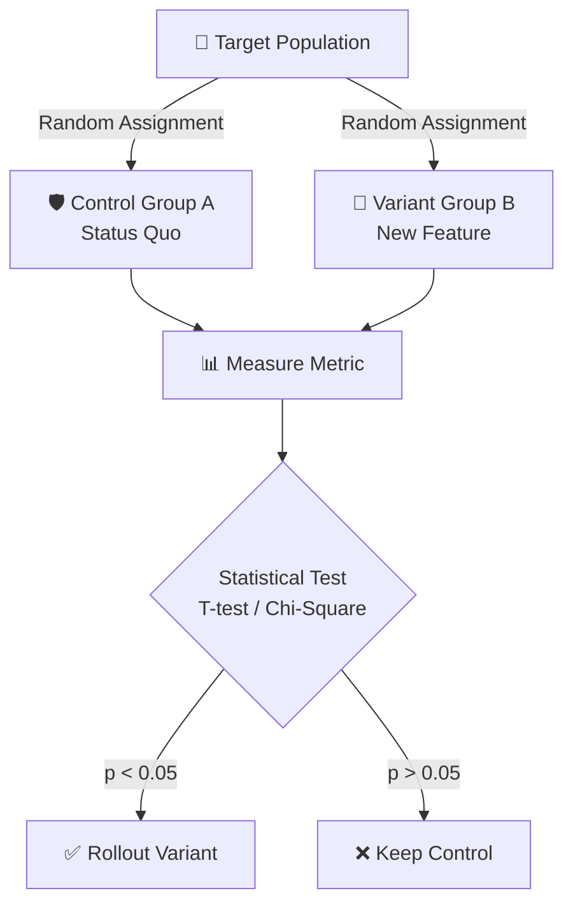

### 🧠 Mental Model
Randomization is the great equalizer. It ensures that both known confounders (age, location) and *unknown* confounders are evenly distributed across groups. If you don't randomize, you have an observational study, not an experiment.

### ✏️ Exercises

**Exercise 1 (Beginner)**
A company wants to test a new checkout page. They decide to show the new page only to users who visit the site on weekends, and the old page to users who visit on weekdays. What is fundamentally wrong with this design?

**Exercise 2 (Data Science Thinking)**
You are testing a new search algorithm. You randomly assign 50% of users to Control and 50% to Variant. However, the Variant group has a significantly higher average income than the Control group. Did the randomization fail? How do you check?

<details>
<summary><b>✅ Click to see Solutions</b></summary>
<br>

- **Ex 1:** This violates random assignment. Weekend users and weekday users have fundamentally different behaviors (e.g., more free time, different purchase intent). This introduces **Selection Bias**. Any difference in conversion could be due to the day of the week, not the checkout page.
- **Ex 2:** Randomization can occasionally produce imbalanced groups by pure chance (though unlikely with large N). You check this by running an **A/A test** or checking baseline metrics (like average income) between the groups *before* the treatment starts. If they are significantly different (p < 0.05), the randomization may be flawed, or you need to use stratified randomization.
</details>

---

## 🎥 Video 31: Power Analysis & Sample Size

### 📘 Notes
Before running an experiment, you must calculate how many samples you need. This is **Power Analysis**.
- **Statistical Power ($1 - \beta$):** The probability of correctly rejecting a false null hypothesis (detecting a real effect). Standard is 80% (0.80).
- **Effect Size:** The minimum difference you care about detecting (e.g., a 2% increase in conversion).
- **Significance Level ($\alpha$):** Usually 0.05.

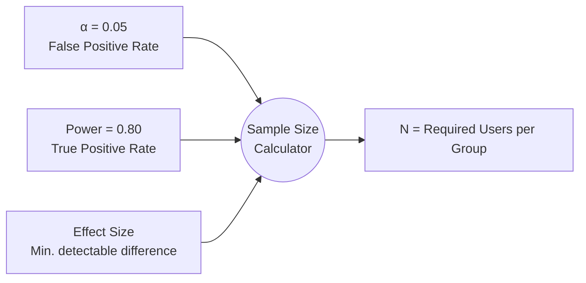

### 🧠 Mental Model
Running an underpowered experiment is like looking through a blurry telescope. If the effect is small and your sample is tiny, you will get a "not significant" result, but you won't know if the effect is truly zero or if you just didn't have enough data to see it.

### ✏️ Exercises

**Exercise 1**
You want to detect a very small effect size (e.g., a 0.1% increase in click-through rate). Do you need a larger or smaller sample size compared to detecting a 5% increase?

**Exercise 2**
Your team ran an A/B test for 2 days and got a p-value of 0.06. They want to "just run it for 2 more days to see if it drops below 0.05." Why is this statistically dangerous?

<details>
<summary><b>✅ Click to see Solutions</b></summary>
<br>

- **Ex 1:** Much larger. Smaller effect sizes require exponentially larger sample sizes to distinguish the signal from the noise.
- **Ex 2:** This is called **Peeking** or optional stopping. By repeatedly checking the p-value and stopping only when it's significant, you drastically inflate the Type I error rate (False Positives). You must decide your sample size *before* the test starts and stick to it.
</details>

---

## 🎥 Video 32: Bias-Variance Tradeoff

### 📘 Notes
The fundamental tension in machine learning model performance.
- **Bias:** Error from overly simplistic assumptions (Underfitting). The model misses the relevant relations between features and target.
- **Variance:** Error from sensitivity to small fluctuations in the training set (Overfitting). The model models the random noise instead of the underlying pattern.

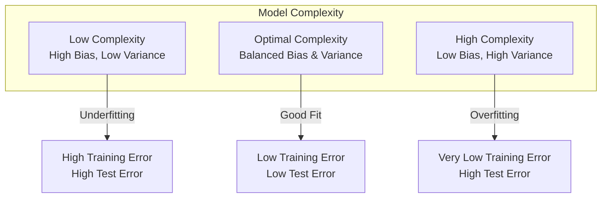

### 🧠 Mental Model
- **High Bias:** "I think all houses cost $200k regardless of size." (Too simple).
- **High Variance:** "This specific house costs exactly $200,143.50 because the previous owner had a dog named Max." (Memorizing noise).
The goal is to find the "sweet spot" in the middle using techniques like Regularization (L1/L2) or Ensemble methods (Random Forest).

### ✏️ Exercises

**Exercise 1**
A decision tree is trained to a maximum depth of 20. It achieves 99% accuracy on the training data but only 60% accuracy on the test data. Is this high bias or high variance?

**Exercise 2**
How does increasing the size of your training dataset affect bias and variance?

<details>
<summary><b>✅ Click to see Solutions</b></summary>
<br>

- **Ex 1:** High Variance (Overfitting). The model has memorized the training data (including noise) and fails to generalize to unseen data.
- **Ex 2:** Increasing dataset size generally **reduces variance** (the model is less sensitive to noise because there's more signal) but has little to no effect on bias (a fundamentally flawed model will still be flawed, just with more data).
</details>

 a
## 🎥 Video 33: Model Evaluation Metrics (Beyond Accuracy)

### 📘 Notes
Accuracy is often misleading, especially with imbalanced datasets.
- **Precision:** Of all predicted positives, how many were actually positive? (Quality of positive prediction).
- **Recall (Sensitivity):** Of all actual positives, how many did we find? (Quantity of positives found).
- **F1-Score:** Harmonic mean of Precision and Recall. Good for imbalanced data.
- **ROC-AUC:** Measures the model's ability to distinguish between classes across all possible thresholds. 0.5 = random guessing, 1.0 = perfect.

```mermaid
graph TD
    Actual[Actual Positive] -->|Model says Yes| TP[True Positive]
    Actual -->|Model says No| FN[False Negative<br>Missed]
    ActualNeg[Actual Negative] -->|Model says Yes| FP[False Positive<br>False Alarm]
    ActualNeg -->|Model says No| TN[True Negative]
    
    TP & FP --> Precision[Precision = TP / (TP + FP)]
    TP & FN --> Recall[Recall = TP / (TP + FN)]
```

### 🧠 Mental Model
- **Spam Detection:** High Precision is crucial (don't send important emails to spam).
- **Cancer Screening:** High Recall is crucial (don't miss any actual cancer cases, even if it means a few false alarms).

### ✏️ Exercises

**Exercise 1**
A fraud detection model flags 100 transactions as fraud. 20 of them are actually fraud, and 80 are normal. What is the Precision?

**Exercise 2**
There are 50 actual fraud cases in a dataset. The model catches 45 of them, but misses 5. What is the Recall?

<details>
<summary><b>✅ Click to see Solutions</b></summary>
<br>

- **Ex 1:** Precision = TP / (TP + FP) = 20 / (20 + 80) = 20 / 100 = 20%. (The model is very "trigger happy").
- **Ex 2:** Recall = TP / (TP + FN) = 45 / (45 + 5) = 45 / 50 = 90%. (The model is good at finding the actual fraud).
</details>

---

## 🎥 Video 34: Handling Missing Data & Outliers

### 📘 Notes
Real-world data is messy. How you handle missingness impacts your model.
- **MCAR (Missing Completely at Random):** No pattern. Safe to drop or impute.
- **MAR (Missing at Random):** Missingness depends on observed data (e.g., men are less likely to report age). 
- **MNAR (Missing Not at Random):** Missingness depends on the unobserved value itself (e.g., high earners refuse to report income). This is the hardest to handle.

**Imputation Strategies:** Mean/Median (simple), KNN Imputation (advanced), or adding a "Missing" category for categorical variables.

### 🧠 Mental Model
Never just blindly drop rows with missing data unless you are certain it's MCAR and the amount is tiny (<5%). Dropping data introduces bias. Always ask: *"Why is this data missing?"*

### ✏️ Exercises

**Exercise 1**
In a survey about salary, people with very high salaries are less likely to fill out the "Income" field. What type of missingness is this? If you impute with the mean, what happens to your analysis?

**Exercise 2**
You have a numerical feature `Age` with 15% missing values and a few extreme outliers (e.g., age = 150). Should you impute with the Mean or the Median? Why?

<details>
<summary><b>✅ Click to see Solutions</b></summary>
<br>

- **Ex 1:** MNAR (Missing Not at Random). If you impute with the mean, you will artificially lower the average income of the high-earner group (or the whole dataset), biasing your model and underestimating true income.
- **Ex 2:** Median. The median is robust to outliers. The mean would be skewed upward by the "150" values, making the imputed ages for missing data unrealistically high.
</details>

 in
## 🎥 Video 35: The Complete Data Science Workflow

### 📘 Notes
Statistics is not just math; it's a process to solve business problems.
1. **Define the Problem:** What business decision will this model inform?
2. **Data Collection & Cleaning:** Handle missing values, outliers, and types.
3. **Exploratory Data Analysis (EDA):** Distributions, correlations, hypotheses.
4. **Feature Engineering:** Create meaningful variables (e.g., `Days_Since_Last_Login`).
5. **Modeling & Validation:** Train/test split, cross-validation, hyperparameter tuning.
6. **Evaluation:** Check metrics against business goals (e.g., is 80% recall worth the 30% false positive rate?).
7. **Deployment & Monitoring:** Put it in production and monitor for **Data Drift** (when real-world data changes and the model degrades).

```mermaid
graph LR
    A[1. Business Problem] --> B[2. Data Collection]
    B --> C[3. EDA & Cleaning]
    C --> D[4. Feature Engineering]
    D --> E[5. Modeling & CV]
    E --> F[6. Evaluation]
    F --> G[7. Deployment & Monitoring]
    G -.->|Data Drift Detected| C
```

### 🧠 Mental Model
A model with 99% accuracy is useless if it doesn't solve the business problem, if the data is biased, or if it takes 10 seconds to run a prediction when the business needs it in 10 milliseconds. Always optimize for **business value**, not just mathematical elegance.

### ✏️ Exercises

**Exercise 1**
You build a highly accurate model to predict customer churn. The business team says, "Great, we will use this to send a 50% discount code to everyone predicted to churn." What is the statistical/business flaw in this plan?

**Exercise 2**
Six months after deploying your model, its accuracy drops from 90% to 75%. No code was changed. What statistical phenomenon likely occurred, and what is your first step?

<details>
<summary><b>✅ Click to see Solutions</b></summary>
<br>

- **Ex 1:** **Self-Fulfilling Prophecy / Intervention Bias.** If you give a 50% discount to everyone predicted to churn, you are changing their behavior. The model was trained on historical data *without* the discount. The model's predictions are no longer valid because the underlying data-generating process has changed.
- **Ex 2:** **Data Drift** (or Concept Drift). The real-world distribution of the input features or the relationship to the target has changed (e.g., a new competitor entered the market, or user behavior changed post-pandemic). First step: Compare the distribution of current production data to the original training data to identify which features drifted.
</details>

---

### 💻 Python Practice: The Workflow in Action

Here is a skeleton of how a robust workflow looks in Python using `scikit-learn`.

 is
```python
import pandas as pd
import numpy as np
from sklearn.model_selection import train_test_split, cross_val_score, StratifiedKFold
from sklearn.impute import SimpleImputer
from sklearn.preprocessing import StandardScaler
from sklearn.ensemble import RandomForestClassifier
from sklearn.metrics import classification_report, roc_auc_score

# 1. Load Data
df = pd.read_csv('customer_data.csv')

# 2. Preprocessing Pipeline (Conceptual)
# Impute missing numerical values with median (robust to outliers)
imputer = SimpleImputer(strategy='median')
df['Age'] = imputer.fit_transform(df[['Age']])

# 3. Define Features (X) and Target (y)
X = df.drop('Churn', axis=1)
y = df['Churn']

# 4. Train/Test Split (Stratified to maintain class balance)
X_train, X_test, y_train, y_test = train_test_split(
    X, y, test_size=0.2, random_state=42, stratify=y
)

# 5. Modeling & Cross-Validation
model = RandomForestClassifier(random_state=42)

# 5-fold cross-validation to check for overfitting (Variance)
cv_scores = cross_val_score(model, X_train, y_train, cv=5, scoring='roc_auc')
print(f"CV ROC-AUC Mean: {cv_scores.mean():.3f} (+/- {cv_scores.std() * 2:.3f})")

# 6. Final Evaluation on Hold-out Test Set
model.fit(X_train, y_train)
y_pred = model.predict(X_test)
y_prob = model.predict_proba(X_test)[:, 1]

print("\nClassification Report:")
print(classification_report(y_test, y_pred))
print(f"ROC-AUC Score: {roc_auc_score(y_test, y_prob):.3f}")
```

---

### 🚀 Mini Project 5: The Capstone Workflow

**Scenario:** 
You are the Lead Data Scientist at a subscription box company. The CEO wants to reduce churn. You have historical data on 10,000 users.

**Tasks:**
1. **EDA & Cleaning:** You notice `Subscription_Length` has 10% missing values, and the distribution is heavily right-skewed. How do you handle the missing values?
2. **Experimental Design:** You design an intervention: a personalized email campaign. How do you ensure the test is valid?
3. **Evaluation:** Your churn prediction model has an Accuracy of 92%, but a Recall of 30%. The CEO is thrilled with the 92% accuracy. How do you explain why this model is actually failing the business goal?
4. **Monitoring:** What metric will you track in production to ensure the model doesn't silently degrade over the next 6 months?

<details>
<summary><b>✅ Click to see Solutions</b></summary>
<br>

**1. EDA & Cleaning:** 
Because the distribution is right-skewed, the mean will be artificially high. Use **Median imputation** for the missing `Subscription_Length` values. Alternatively, create a new binary feature `Is_Sub_Length_Missing` to capture any potential MNAR signal.

**2. Experimental Design:** 
Randomly assign the 10,000 users into a Control group (no email) and a Variant group (personalized email). Ensure the split is **stratified** by key variables (e.g., current subscription tier) to guarantee both groups are identical at baseline. Run the test for a pre-calculated duration based on a **Power Analysis**.

**3. Evaluation:** 
"CEO, the 92% accuracy is misleading because our dataset is imbalanced (e.g., 92% of users *don't* churn). The model could achieve 92% accuracy simply by guessing 'No Churn' for everyone. The **Recall of 30%** means we are missing 70% of the customers who are actually about to leave. We need to optimize the model for higher Recall, even if it means accepting a lower overall accuracy."

**4. Monitoring:** 
Track **Data Drift** (e.g., using Population Stability Index - PSI, or Kolmogorov-Smirnov tests) on key input features like `Login_Frequency` or `Customer_Support_Tickets`. Also, monitor the model's predicted probability distribution to ensure it hasn't shifted drastically from the training baseline.
</details>

---


